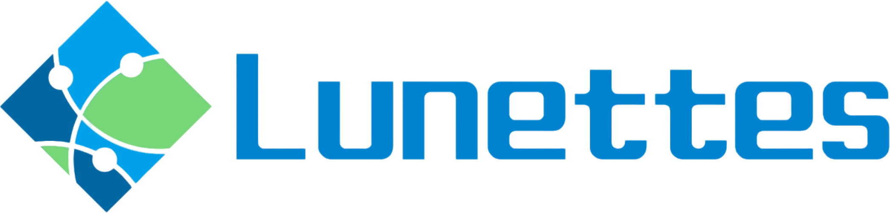

<p align="center">

</p>

# Lunettes - 容器生命周期可观测服务
<strong><p align="center">Observe Your Stack, Energize Your APP</p></strong>

<p align="center">


</p>


## 🌾 简介

Kubernetes 广泛用于构建容器服务（Caas）平台，其包含了众多自治组件共同驱动容器的交付过程，具有相当的复杂性。对开发人员和 SRE 来说，使用起来并非很容易。

Lunettes 的综合可观测性服务利用不同的可观测信息（例如 K8s apiserver 请求和事件）来构建容器生命周期 SLI/SLO，提供诊断服务和跟踪服务，使开发人员和 SRE 能够以数字化方式监控和管理 Kubernetes 上的服务。

Lunettes 提供了用户友好的故障排除和服务性能优化方法，Lunettes 的解决方案可以帮助用户提高 Kubernetes 上的服务的整体质量。

## 🔥 功能特性
### 资源交付 SLI/SLO 服务
Lunettes 计算基础设施交付容器的时间（在 Kubernetes 上的 Pod），并将此指标定义为容器交付的 SLI。
基于这个指标，Lunettes 识别出容器生命周期不同交付阶段的时间，包括调度、镜像拉取、IP 分配和容器启动，并且可以计算出总体的时间消耗。另一方面，容器交付的 SLO 是基于容器规格定义的，因容器规格不同而有所差异。
Lunettes 对容器交付的 SLI/SLO 的定义使得应用服务的负责人能够以数字化的方式评估和改进 K8s 平台资源交付过程的质量。


### 容器生命周期 诊断服务
Lunettes 分析整个容器生命周期中可观测信息，来定位容器交付过程中遇到的问题的根本原因，并为错误根因分配一个错误码。这个错误码/错误信息涵盖了常见的问题，例如资源消耗过多错误、配置错误等等。


### 容器生命周期 跟踪服务
Lunettes 可以识别容器生命周期每个交付阶段的开始和结尾，并且基于阶段信息创建了遵循 OpenTelemetry 标准的用于 tracing 展示的数据结构。


## 🎬 开始

### 快速开始

我们提供了一个通过 [kind](https://kind.sigs.k8s.io/) 快速部署 Lunettes 的[指南](./docs/quick_start.md).

### 部署
第一步：通过 Kubeadm/Kind 来创建一个 Kubernetes 集群
- [Creating a cluster with kubeadm](https://kubernetes.io/docs/setup/production-environment/tools/kubeadm/create-cluster-kubeadm/)

以下方式将通过 NodePort 暴露服务, 请确保您当前的操作环境可以访问 Kubernetes nodeIP

第二步：通过 Helm 安装 Lunettes
```bash
# install lunettes
# 该过程开启apiserver的审计功能，apiserver会发生重启
helm upgrade --install lunettes oci://registry-1.docker.io/lunettes/lunettes-chart --version [version]

#如果kubernetes版本 < v1.21，需要设置policyVersion的版本
helm upgrade --install lunettes oci://registry-1.docker.io/lunettes/lunettes-chart --version [version] \
--set policyVersion=v1beta1
```

查看可用的[版本号](https://hub.docker.com/r/lunettes/lunettes-chart/tags)

第三步：获取 Lunettes 服务的接口
```bash
export LUNETTES_IP=node_ip
export GRAFANA_NODEPORT=$(kubectl -n lunettes get svc grafana -o jsonpath='{.spec.ports[0].nodePort}')
export JAEGER_NODEPORT=$(kubectl -n lunettes get svc jaeger-collector -o jsonpath='{.spec.ports[0].nodePort}')
```

在浏览器打开 [http://[LUNETTES_IP]:[GRAFANA_NODEPORT]](http://[LUNETTES_IP]:[GRAFANA_NODEPORT]) 然后访问 debugpod 或者 debugslo 接口。默认的用户名和密码是 `admin:admin`.

在浏览器打开 [http://[LUNETTES_IP]:[JAEGER_NODEPORT]/search?](http://[LUNETTES_IP]:[JAEGER_NODEPORT]/search?) 然后访问 trace 接口。


## 🛠 配置
Lunettes是一个高度可配置化的服务。下面是一个实例，用户可以简单地配置资源交付SLO以及容器生命周期Tracing以适配不同的场景。

### SLO 配置
```json
{
    "UserOnlineConfigMap":{
        "test-ns-one":"1m30s",
        "test-ns-two":"6m"
    },
    "IgnoredNamespaceForAudit":[
        "app-ns"
    ],
    "IgnoreDeleteReasonNamespace":[
        "test-ns-three",
        "test-ns-four"
    ]
}
```
### Tracing 配置
```json
[
  {
    "ObjectRef":{
      "Resource":"pods",
      "Name":"PodSpans",
      "APIVersion":"v1"
    },
    "ActionType":"PodCreate",
    "LifeFlag":{
      "Mode":"start-finish",
      "StartEvent":[
        {
          "Type":"operation",
          "Operation":"pod:create:success"
        }
      ],
      "FinishEvent":[
        {
          "Type":"operation",
          "Operation":"condition:Ready:true"
        }
      ]
    },
    "ExtraProperties":{
      "bizName":{
        "Name":"",
        "ValueRex":"metadata#labels#meta.k8s.com/biz-name",
        "NeedMetric":true
      }
    },
    "Spans":[
      {
        "Name":"default_schedule_span",
        "Type":"default_schedule_span",
        "SpanOwner":"k8s",
        "Mode":"start-finish",
        "StartEvent":[
          {
            "Type":"operation",
            "Operation":"schedule:default-scheduler:entry"
          }
        ],
        "EndEvent":[
          {
            "Type":"operation",
            "Operation":"schedule:binding:success"
          }
        ]
      }
    ]
  }
]
```

## 📑 文档
详情请见 [docs](/docs)

## 💡 社区
您有任何与 Lunettes 有关的问题可以通过下列方式联系我们：
- Slack
- [钉钉](https://qr.dingtalk.com/action/joingroup?code=v1,k1,11giuLFUSQIWJ1Otmzn2egYQnu9p+sNhe1yktypjpz0=&_dt_no_comment=1&origin=11)
- [Github Issue](https://github.com/alipay/container-observability-service/issues)
