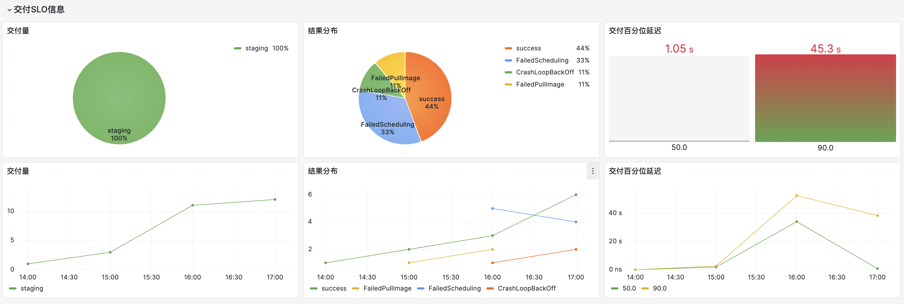
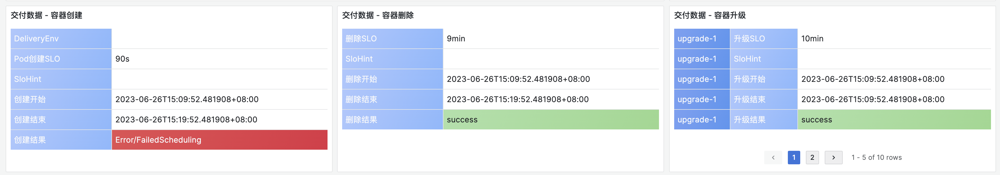
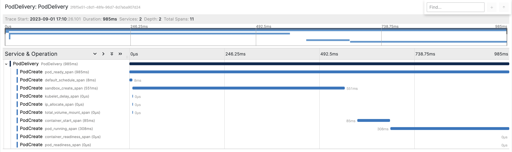

# Lunettes - Kubernetes Container Lifecycle Observability Service

## Introduction

Kubernetes is widely used for building container-as-a-service platforms, but its numerous autonomous components working together to drive the container delivery process can create significant complexity for developers and SREs.

Lunettes' comprehensive observability service leverages different observability signals - such as apiserver requests and events - to create container lifecycle SLIs/SLOs, diagnosis, and tracing services that enable developers and SREs to monitor and manage their services on Kubernetes in a digitalized manner.

By providing a user-friendly approach to troubleshooting and performance optimization, Lunettes' solution can help improve the overall quality of services on Kubernetes.

## Key features
### Resource Delivery SLIs/SLOs:
Lunettes calculates the time taken by the infrastructure to attempt to deliver a container (Pod on Kubernetes) and defines this metric as the container delivery SLI. Based on this metric, Lunettes recognizes the time costs associated with different container lifecycle stages, including scheduling, image pulling, IP allocation, and container starting, thereby enabling the calculation of total infrastructure time consumption. The container delivery SLO, on the other hand, is defined based on container specifications.

Lunettes' definition of the container delivery SLI/SLO enables service owners to evaluate and improve the quality of the platform's resource delivery process in a digitalized manner.


### Container Lifecycle Diagnose Service
To identify the root cause of any issues, Lunettes analyzes observability signals throughout the container lifecycle and assigns an error code that covers common problems such as excessive resource consumption error, configuration errors, etc.



### Container Lifecycle Tracing Service
By recognizing the start and end of each container lifecycle stage, Lunettes is able to construct a tracing structure that follows OpenTelemetry standards.



## Getting Started

### Quick Start

To get started with [kind](https://kind.sigs.k8s.io/) quickly, see [this guide](./docs/QUICK_START.md).

### Deploy
Step1: Bootstrap a Kubernetes cluster with Kubeadm/Kind.

- [Creating a cluster with kubeadm](https://kubernetes.io/docs/setup/production-environment/tools/kubeadm/create-cluster-kubeadm/)
- [kubectl](https://kubernetes.io/docs/tasks/tools/)
- [Installing Helm](https://helm.sh/docs/intro/install/)

The following method will expose the service through NodePort. Please make sure that your current operating environment can access the Kubernetes nodeIP.

Step2: Install Lunettes with Helm
```bash
# Use NodePort
helm install deploy/helm/lunettes \
  # Setting enableAuditApiserver to true will enable the auditing of the apiserver for you.
  # Please note that this process will restart the apiserver.
  --set enableAuditApiserver=true
  --set grafanaType=NodePort
  --set jaegerType=NodePort
```

Step3: Find the endpoint of Lunettes dashboard service
```bash
export LUNETTES_IP=node_ip
export GRAFANA_NODEPORT=$(kubectl -n lunettes get svc grafana -o jsonpath='{.spec.ports[0].nodePort}')
export JAEGER_NODEPORT=$(kubectl -n lunettes get svc jaeger-collector -o jsonpath='{.spec.ports[0].nodePort}')
```

Open [http://[LUNETTES_IP]:[LUNETTES_NODEPORT]](http://[LUNETTES_IP]:[LUNETTES_NODEPORT]) in your browser and access debugpod or debugslo endpoint, the default username and password are `admin:admin`.

Open [http://[LUNETTES_IP]:[JAEGER_NODEPORT]/search?](http://[LUNETTES_IP]:[JAEGER_NODEPORT]/search?) in your browser and access trace endpoint.

## Configurations
Lunettes is highly configurable. Below we give some examples of how you can adjust resource delivery SLO and container lifecycle tracing to different scenarios with simple configurations.
### Resource Delivery SLO configuration
```json
{
    "UserOnlineConfigMap":{
        "test-ns-one":"1m30s",
        "test-ns-two":"6m"
    },
    "IgnoredNamespaceForAudit":[
        "app-ns"
    ],
    "IgnoreDeleteReasonNamespace":[
        "test-ns-three",
        "test-ns-four"
    ]
}
```
### Container Lifecycle Tracing configuration
```json
[
  {
    "ObjectRef":{
      "Resource":"pods",
      "Name":"PodSpans",
      "APIVersion":"v1"
    },
    "ActionType":"PodCreate",
    "LifeFlag":{
      "Mode":"start-finish",
      "StartEvent":[
        {
          "Type":"operation",
          "Operation":"pod:create:success"
        }
      ],
      "FinishEvent":[
        {
          "Type":"operation",
          "Operation":"condition:Ready:true"
        }
      ]
    },
    "ExtraProperties":{
      "bizName":{
        "Name":"",
        "ValueRex":"metadata#labels#meta.k8s.com/biz-name",
        "NeedMetric":true
      }
    },
    "Spans":[
      {
        "Name":"default_schedule_span",
        "Type":"default_schedule_span",
        "SpanOwner":"k8s",
        "Mode":"start-finish",
        "StartEvent":[
          {
            "Type":"operation",
            "Operation":"schedule:default-scheduler:entry"
          }
        ],
        "EndEvent":[
          {
            "Type":"operation",
            "Operation":"schedule:binding:success"
          }
        ]
      }
    ]
  }
]
```


## Documentation
Please visit [docs]()

## Community
Any questions related to Lunettes please reach us via:
- Slack
- DingTalk
- GitHub Issue
